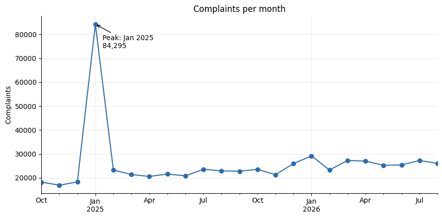
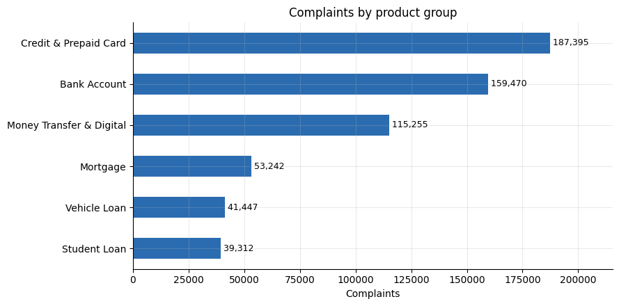
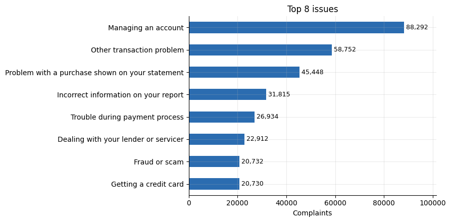
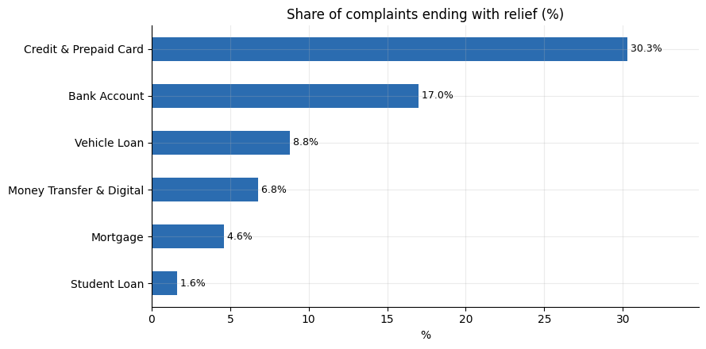
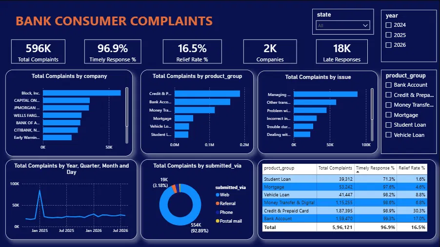

# Bank Consumer Complaints Analysis (CFPB)

**End-to-end business analytics project: Python data pipeline, exploratory analysis and an interactive Power BI dashboard on 596,121 US banking complaints.**


---

## Table of Contents
1. [About the Project](#about-the-project)
2. [Business Problem](#business-problem)
3. [Objectives](#objectives)
4. [Tools and Technologies](#tools-and-technologies)
5. [Dataset](#dataset)
6. [Methodology](#methodology)
7. [Key Findings](#key-findings)
8. [Dashboard](#dashboard)
9. [Business Recommendations](#business-recommendations)
10. [Project Structure](#project-structure)
11. [Conclusion and Future Scope](#conclusion-and-future-scope)


---

## About the Project

Banks and payment companies receive thousands of customer complaints every month, but raw counts do not say what to fix first. This project turns the public **CFPB Consumer Complaint Database** into decisions: which products and issues cause the most dissatisfaction, which companies respond late, and where the next improvement effort should go.

I built the whole workflow myself: collected the data through the CFPB API, validated and cleaned it, explored it in Python, and presented it in a one-page Power BI dashboard, with a written business report.

| | |
|---|---|
| **Records analysed** | 596,121 complaints |
| **Period** | October 2024 to August 2026 (23 complete months) |
| **Products** | 6 groups (cards, bank accounts, digital payments, mortgages, vehicle loans, student loans) |
| **Companies** | 2,428 |

## Business Problem

> *Which banking products and issues cause the most customer complaints, which companies respond too slowly, and what should an institution fix first?*

The project is framed as work for the Customer Experience and Compliance Analytics team of a retail financial services provider, using the public CFPB data as an industry benchmark. (The scenario is a learning framing; no company engaged me and all results come from public data.)


## Objectives

1. Measure complaint volume and trend across six consumer banking product groups.
2. Identify the top issues, overall and within each product.
3. Evaluate response quality: timely-response rate and relief rate, by product and company.
4. Find and explain anomalies (such as January 2025) so they do not distort decisions.
5. Deliver prioritised, evidence-based recommendations with KPIs to track.
6. Build an interactive Power BI dashboard for non-technical stakeholders.
   

## Tools and Technologies

| Area | Tools |
|---|---|
| Data collection | Python, `requests`, CFPB public API |
| Cleaning and analysis | Python, `pandas`, `numpy`, `matplotlib`, Google Colab |
| Dashboard | Microsoft Power BI Desktop, DAX |
| Version control and docs | Git, GitHub, Word/PDF report |


## Dataset

| Item | Detail |
|---|---|
| **Source** | [CFPB Consumer Complaint Database](https://www.consumerfinance.gov/data-research/consumer-complaints/) (public API, no key needed) |
| **Raw download** | 630,670 rows x 15 columns |
| **After cleaning** | 596,121 rows x 23 columns |
| **Products** | Checking or savings account, Credit card, Prepaid card, Mortgage, Vehicle loan or lease, Student loan, Money transfer / virtual currency / money service |
| **Excluded on purpose** | Credit reporting and debt collection. They concern credit bureaus and collectors, not banks, and in the month checked (August 2026) credit-reporting complaints (623,453) outnumbered all banking products combined (27,163) |
| **Target variable** | None (descriptive and diagnostic analytics). `timely_flag` and `relief_flag` act as outcome measures |

The cleaned dataset is stored in `complaints_clean.csv. 


## Methodology

```
CFPB API   ->  Clean  ->  Explore (EDA)  ->  Export CSV  ->  Power BI  ->  Insights
```

1. **Collect.** Downloaded each month through the API and compared the downloaded row count with the count the API reported. A month is saved only if the two match, and the run can resume after a failure.
2. **Clean.** Standardised column names, removed duplicates, parsed dates, trimmed text, merged company spelling variants (2,429 to 2,428), labelled blanks instead of deleting rows, and created helper columns (`timely_flag`, `relief_flag`, `product_group`, time fields).
3. **Explore.** Seven charts and several summary tables, with an insight and recommendation under every chart in the notebook.
4. **Visualise.** A one-page Power BI dashboard whose numbers match the Python results exactly.


## Key Findings

| # | Finding |
|---|---|
| 1 | **Three product groups hold 77.5% of complaints:** credit and prepaid cards (31.4%), bank accounts (26.8%), money transfer and digital (19.3%) |
| 2 | **Three everyday issues make up 32.3%:** managing an account (88,292), other transaction problem (58,752), problem with a purchase on a statement (45,448) |
| 3 | **Student loans respond late:** 71.3% timely against 97.6% to 99.3% for every other product. They are 6.6% of complaints but roughly 62% of late responses. MOHELA: 45.5% timely on 14,771 complaints |
| 4 | **Relief is rare outside cards and accounts:** 30.3% (cards) and 17.0% (accounts) against 4.6% (mortgages) and 1.6% (student loans) |
| 5 | **January 2025 was a 3.6x anomaly (84,295 complaints):** Block and Early Warning Services made up 57% of the month and one issue ("Other transaction problem") 50%. Public reporting links this period to enforcement news and social media activity |
| 6 | **Concentration is high:** the top 10 companies hold 48.2% of complaints, and the top 10 states hold 62.2% |
| 7 | **Intake is not the bottleneck:** 88.5% of complaints are forwarded to the company the same day, and Web is 92.9% of channels |


<p align="center">
  
  
</p>
<p align="center">
  
  
</p>


More charts, with the insight and recommendation for each, are in the [notebook](python/cfpb_bank_complaints_final.ipynb) and in the [full report](documents/Project_Report_Bank_consumer_complaints.pdf).


## Dashboard

A one-page Power BI dashboard with five KPI cards (Total Complaints, Timely Response %, Relief Rate %, Companies, Late Responses), charts by company, product, issue, month and channel, a response-quality table, and slicers for state, year and product group.





## Business Recommendations

| Rank | Recommendation | Evidence |
|---|---|---|
| 1 | Fix account-management and transaction problems with self-service tools, clearer error messages and status tracking | These two issues are 24.7% of all complaints |
| 2 | Close the student-loan response gap with servicer response-time targets and weekly monitoring | 71.3% timely; about 62% of late responses |
| 3 | Add anomaly alerts for complaint surges and separate campaign-driven spikes from real service failures | January 2025 was 3.6x a typical month |
| 4 | Improve card-dispute handling and credit-report data quality | 45,448 statement-purchase problems; 31,815 incorrect-report complaints |
| 5 | Strengthen fraud and scam protection in digital payments | 115,255 complaints at only 6.8% relief |
| 6 | Benchmark fairly: normalise per customer and per capita, and report with and without January 2025 | Raw counts favour large firms |

**Illustrative impact (estimates under stated assumptions, not forecasts):** a 10% reduction in the top two issues would remove about 14,700 complaints; lifting student-loan timeliness to about 98% would remove about 10,500 late responses and raise the overall timely rate from 96.9% to roughly 98.7%.


## Project Structure

```
bank-consumer-complaints-analysis/
├── README.md
├── .gitignore
│
├── data/
│   ├── data_dictionary.csv                         
│   └── cfpb_powerbi_files.zip                      # cleaned dataset (complaints_clean.csv, 596,121 rows)
│
├── documents/
│   ├── Project_Report_Bank_consumer_complaints.pdf     # full business report 
│   └── images/                                    
│
├── powerbi/
│   ├── cfpb_bank_complaints.pbix                   # Power BI dashboard file
│   ├── dashboard_screenshot.png
│
└── python/
    ├── cfpb_bank_complaints_final.ipynb      # collection, cleaning, EDA, insights under every chart
```


## Conclusion and Future Scope

Cards, bank accounts and digital payments drive most complaints, response quality is high overall, and student loans are a clear weak spot for timeliness. The January 2025 spike shows why trends should be read with and without anomalies.

**Next steps:** normalise by customer base and population, add text analytics on complaint narratives, forecast monthly volume, build models to predict late responses or relief, load the data into SQL, and automate monthly refreshes.


